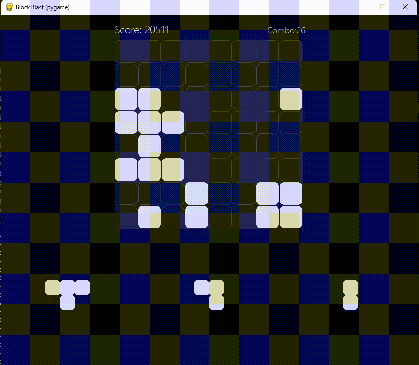

# Block Blast AI — Genetic Algorithm Agent + OCR Overlay

> A self-contained Block Blast puzzle game paired with an AI agent that **learns to play through evolution**, plus a computer-vision overlay that brings the same intelligence to any real Block Blast window.

---

## Demo

### Simulation — AI agent playing the built-in Pygame game



---

### OCR Overlay — AI hints on a live game window


---

## What This Project Does

The project ships in two modes that share the same AI core:

| Mode | What it is |
|---|---|
| **`block_bast/`** | Full Pygame simulation with a built-in game engine, AI agent, and genetic trainer |
| **`OCR/`** | Computer-vision layer that reads a live game window and draws best-move hints on top |

Both modes use the same evaluation logic and the same evolved weights — train once in the simulation, deploy instantly to the real game.

---

## Architecture

```
block-blast-ai-training/
├── block_bast/          # Pygame game + AI agent + genetic trainer
│   ├── main.py          # Entry point
│   ├── game.py          # 8×8 board logic, line clearing, scoring, combos
│   ├── pieces.py        # 26 piece shapes + pool factory
│   ├── ui.py            # Pygame rendering, drag-and-drop, action.json consumer
│   ├── ai.py            # Greedy search agent — reads state.json, writes action.json
│   ├── ai_trainer.py    # Steady-state genetic algorithm (population size 10)
│   └── state_io.py      # Serialises game state to state.json
│
├── OCR/                 # Vision-based hint overlay for an external game window
│   ├── screen.py        # Interactive region selector + mss screenshot capture
│   ├── board_render.py  # OpenCV colour-matching → 8×8 boolean grid
│   ├── hand_render.py   # OpenCV background subtraction → piece reconstruction
│   ├── state_OCR.py     # Orchestrates capture → state.json
│   └── game.py          # Pygame overlay — draws ghost + slot label at ~10 fps
│
└── shared/
    ├── ai_core.py       # Shared evaluation engine (14-feature weighted scorer)
    ├── config.py        # Board constants, colours, timing
    └── weights.json     # Best weights from the latest training run
```

### Component communication

All modules talk through plain JSON files. Every component is independently restartable and swappable.

```
ui.py / state_OCR.py ──► state.json ──► ai.py
ai.py                ──► action.json ──► ui.py
ai_trainer.py        ──► weights.json ──► ai.py
ai_trainer.py        ──► population.json (evolution state)
ai_trainer.py        ──► best_weights.json (all-time best)
```

---

## How the AI Works

### Evaluation (greedy one-ply search)

For every legal *(piece, column, row)* combination, the agent simulates the placement and scores the resulting board with a **14-feature weighted linear formula**:

```
S = w_holes·holes + w_max_height·max_height + w_avg_height·avg_height
  + w_filled·filled + w_edge·edge_penalty + w_cluster·cluster_score
  + w_row·row_almost_full + w_col·col_almost_full + w_empty·empty_rows
  + w_combo·combo_preservation + w_fit·piece_fit + w_div·diversity
  + w_lines·cleared_lines + w_gain·immediate_gain
```

| Feature | What it captures |
|---|---|
| `holes` | Trapped empty cells below filled ones (penalty) |
| `max_height` / `avg_height` | Stack height (penalty) |
| `filled` | Total occupied cells |
| `edge_penalty` | Cells placed on board edges (risky for future placements) |
| `cluster_score` | Adjacent filled cells — rewards compact, dense placement |
| `row_almost_full` / `col_almost_full` | Lines one or two cells from clearing |
| `empty_rows` | Fully empty rows — breathing room |
| `combo_preservation` | Keeps the multiplier chain alive |
| `piece_fit` | How snugly the piece fills existing gaps |
| `diversity` | Penalises large height variance — prefers a flat surface |
| `cleared_lines` | Lines cleared immediately by this move |
| `immediate_gain` | Raw score from this move |

### Training (genetic algorithm)

The weights are not hand-tuned — they are **evolved**:

1. A population of **10 weight sets** is stored in `population.json`.
2. Each set is evaluated over **10 full games**; fitness combines average moves, score, and max combo.
3. After scoring, the top 2 sets survive as elites; the rest are replaced by offspring produced via **uniform crossover + Gaussian mutation**.
4. The all-time best weights are checkpointed to `best_weights.json`.
5. Training runs automatically — when game 10 ends, `ai_trainer.train()` is called, new weights are loaded, and a fresh generation begins.

Bounds for each weight are defined in `BOUNDS` inside `ai_trainer.py` so the search space never produces physically nonsensical values (e.g. a positive weight for holes).

### OCR pipeline

1. On first run, `screen.py` prompts the user to drag two selection rectangles over the live game window — one over the board, one over the hand.
2. `board_render.py` screenshots the board region, samples **9 points per cell**, and classifies each as empty or filled by comparing against the background colour `#182442` with configurable tolerance.
3. `hand_render.py` screenshots the hand region, subtracts background `#395194`, splits the strip into three equal slots, and reconstructs each piece's cell coordinates.
4. `state_OCR.py` combines the two outputs into `state.json` — identical in format to what the simulation produces.
5. The hint overlay displays a green ghost on the board and a slot label at ~10 fps.

---

## Getting Started

### Prerequisites

- Python 3.9+

### Install

```bash
# Simulation only
pip install -r requirements_block_blast.txt

# OCR overlay (includes OpenCV, mss, numpy)
pip install -r requirements_OCR.txt
```

### Run

```bash
# 1. Launch the Pygame simulation
cd block_bast
python main.py

# Type `on` in the AI terminal to start the agent
# Type `off` to pause and play manually
# Press R in the game window to restart
```

```bash
# 2. Launch the OCR hint overlay
cd OCR
python game.py
# Follow the on-screen prompts to select the board and hand regions
```

### Train the AI

The genetic trainer runs automatically alongside the game. To run it standalone:

```bash
cd block_bast
python ai_trainer.py
```

Weights are saved to `best_weights.json` after each generation. Copy to `shared/weights.json` to share with the OCR overlay.

---

## Configuration

All layout and colour constants live in `shared/config.py`:

| Constant | Default | Description |
|---|---|---|
| `BOARD_SIZE` | `8` | Board dimensions (N×N) |
| `CELL` | `48` | Board cell size in pixels |
| `CELL_HAND` | `30` | Hand piece cell size in pixels |
| `BG` | `(20, 22, 28)` | Window background colour |
| `BLOCK` | `(220, 220, 235)` | Filled cell colour |
| `GHOST_OK` | `(140, 255, 170)` | Valid placement preview |
| `GHOST_BAD` | `(255, 120, 120)` | Invalid placement preview |

AI timing is tunable at the top of `ai.py`:

| Constant | Default | Description |
|---|---|---|
| `POLL_DELAY_SEC` | `0.05` | How often the agent polls `state.json` |
| `MOVE_COOLDOWN_SEC` | `0.02` | Minimum delay between moves |

---

## Tech Stack

- **Python 3.12**
- **Pygame** — game rendering and UI
- **OpenCV** — board and piece recognition (OCR mode)
- **mss** — cross-platform screen capture
- **NumPy** — pixel arithmetic

---

## Key Design Decisions

**File-based IPC** — every module communicates through JSON files on disk. This makes each component independently restartable and trivially replaceable without inter-process sockets or shared memory.

**Separation of game logic and rendering** — `game.py` contains zero Pygame code; `ui.py` contains zero game rules. Both can be tested and swapped independently.

**Shared AI core** — `shared/ai_core.py` is imported by both the simulation agent and the OCR overlay agent, so a single training run improves both immediately.

**Steady-state evolution** — replacing only the bottom performers each generation maintains diversity while ensuring progress, avoiding the population collapse that full generational replacement can cause on small populations.